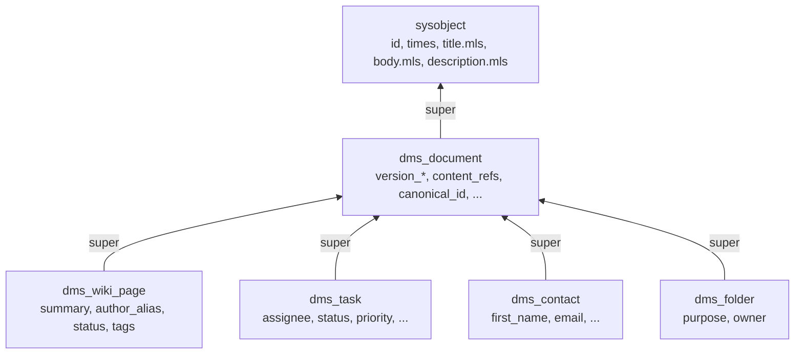
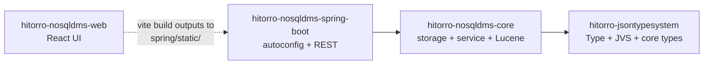

# hitorro-nosqldms

A distributed, RDBMS-free document management system built on the
**hitorro-jsontypesystem** (real JVS types — `dms_document` extends
`sysobject`), KV storage, and Lucene indexing. Reference
implementation for the
[distributed-dms design proposal](https://github.com/geekychris/hitorro-jsontypesystem/blob/main/docs/distributed-dms.md).

> **Full architecture + build + Java API + REST reference (with
> Mermaid diagrams):** [`docs/ARCHITECTURE.md`](docs/ARCHITECTURE.md)

## Type inheritance at a glance



Every DMS type transitively extends `sysobject` — inheriting the JVS
composite `id`, `times`, and multilingual `title`/`body`/`description`
for free. `JsonTypeSystem.getMe().getType("dms_task").getSuper()` →
`dms_document` → `sysobject`.

## What it does today (phase 1)

- **JVS-typed documents.** Types loaded via
  `com.hitorro.jsontypesystem.JsonTypeSystem`. Bundled: 4 domain
  types (`dms_wiki_page`, `dms_task`, `dms_contact`, `dms_folder`)
  all extending `dms_document` → `sysobject`. Drop your own
  `dms_*.json` into `${dms.home}/config/types/` and it's picked up on
  next boot.
- **Versioned documents.** Semver-inspired
  `MAJOR.MINOR.PATCH[-QUALIFIER[N]][+BUILD]` labels; every part
  indexed separately for range queries. Every check-in gets a
  monotonic `versionBuild` so `MAX(build)` always identifies the
  newest version regardless of label.
- **Multi-rendition content with copy-on-write per rendition.** A
  document can carry any number of named renditions (primary,
  thumbnail, extract, transcript, …). Bytes content-addressed by
  sha256 — metadata-only check-in of a 500 MB doc copies **zero
  bytes**. Replacing one rendition splits only that role.
- **First-class relationships kept off the doc body.** References,
  folder memberships, ACL grants, and tags each live in their own
  sibling storage keyspace. Adding a citation, granting an ACL, or
  linking to a folder never rewrites the document.
- **Many-to-many nested folders.** A doc can be linked into any
  number of folders. Folders are themselves documents (type
  `dms_folder`) so folder-in-folder works out of the box. UI lets
  you drill into sub-folders and pick docs to link from a modal.
- **Lucene search with catch-all default field.** Bare queries like
  `chris` match title/body/description/typed fields uniformly via
  the `_all` field. Explicit-field queries (`tf.status:open`,
  `type_name:dms_task`, `version_major:2`) also work.
- **REST API + React UI.** Full HTTP surface + type-differentiated
  UI (colored badges per type, per-type table columns, dynamic form
  driven by the JVS TypeDef). React 18 UI bundled into the Spring
  Boot jar.

## What's deferred (per design roadmap)

Phases 3+ (distribution, ACL inheritance walk, MinIO/S3 blob backends,
blob GC pipeline, check-out leases). Present-day storage is in-memory;
swap in a RocksDB / hitorro-kvstore-backed impl of the six store
interfaces to persist.

## Module layout



```
hitorro-nosqldms/
├── hitorro-nosqldms-core/         — Spring-neutral NoSQL core (types, stores, service, index)
├── hitorro-nosqldms-spring-boot/  — Spring Boot 3 runtime: autoconfig + REST + hosts UI
└── hitorro-nosqldms-web/           — React 18 + Vite + TypeScript UI
```

- **`hitorro-nosql-dms-core`** — no Spring, no RDBMS. `DocumentService`,
  `VersionLabel`, `LuceneIndex`, `DmsContext` (service registry that
  mirrors hitorro's `com.hitorro.util.startupframework.ServiceContext`
  pattern). Depends only on Jackson + Lucene. Content lives in a KV
  keyspace via `BlobStore` (content-addressed by sha256); metadata
  lives in sibling KV keyspaces via `DocumentStore` / `ReferenceStore` /
  `FolderStore` / `AclStore` / `TagStore`.
- **`hitorro-nosqldms-spring-boot`** — pulls core in as a normal dep,
  exposes each service as a Spring bean via `DmsAutoConfiguration`,
  contributes REST controllers. Serves the pre-built React UI from
  `src/main/resources/static/`.
- **`hitorro-nosqldms-web`** — Vite/TypeScript. `vite build` emits directly
  into the Spring Boot module's `static/` dir so the backend jar
  ships the UI.

## Build + run

```bash
# 1. Build the UI (once, or after any web change)
(cd hitorro-nosqldms-web && pnpm install && pnpm build)

# 2. Build + test everything
mvn install

# 3. Run standalone
java -jar hitorro-nosqldms-spring-boot/target/hitorro-nosqldms-spring-boot-0.1.0-app.jar

# 4. Open the UI
open http://localhost:8090
```

### Configuration

Standard Spring Boot properties. Env vars via `application.yml` or
`--dms.home=/some/dir` on the command line.

| Key | Default | Purpose |
|---|---|---|
| `server.port` | `8090` | HTTP port |
| `dms.home`    | `${user.home}/.hitorro/dms` | Persistent storage root |
| `dms.lucene-enabled` | `true` | Toggle Lucene index (falls back to no-op) |
| `dms.lucene-dir` | `${dms.home}/lucene` | Override index location |

## REST surface

Every endpoint returns JSON.

| Method | Path | Purpose |
|---|---|---|
| POST   | `/api/documents` | Create a new doc (v1.0.0) |
| GET    | `/api/documents` | List every canonical id |
| GET    | `/api/documents/{id}` | Current head |
| DELETE | `/api/documents/{id}` | Soft-delete (tombstone) |
| GET    | `/api/documents/{id}/versions` | Version history |
| GET    | `/api/documents/{id}/versions/{label}` | One specific version |
| POST   | `/api/documents/{id}/versions` | Check-in a new version |
| GET    | `/api/documents/{id}/renditions` | Head's renditions |
| GET    | `/api/documents/{id}/renditions/{role}` | Read rendition bytes |
| PUT    | `/api/documents/{id}/versions/{v}/renditions/{role}` | Attach/replace rendition (bytes = body) |
| DELETE | `/api/documents/{id}/versions/{v}/renditions/{role}` | Remove a rendition |
| GET    | `/api/documents/{id}/references` | Outbound refs |
| GET    | `/api/documents/{id}/references/inbound` | Inbound refs |
| POST   | `/api/documents/{id}/references` | Add a ref |
| GET    | `/api/documents/{id}/acls` | ACL grants |
| POST   | `/api/documents/{id}/acls` | Grant permission |
| GET    | `/api/documents/{id}/tags` | Tags |
| POST   | `/api/documents/{id}/tags/{tag}` | Tag |
| GET    | `/api/folders/{folder}/contents` | Folder contents |
| POST   | `/api/folders/{folder}/contents` | Link doc into folder (`{"child":"…"}`) |
| GET    | `/api/folders/for-doc/{child}` | List folders containing this doc |
| GET    | `/api/search?q=…&limit=…` | Lucene classic query grammar |

## Framework-neutral core

For non-Spring use (embedded in another service, batch job, tests):

```java
try (DmsContext ctx = DmsContext.builder()
        .withLucene(Path.of("/tmp/idx"))
        .build()) {

    CreateRequest req = new CreateRequest();
    req.title = "Hello";
    req.contentType = "wiki-page";
    req.createdBy = "user:alice";
    req.withRendition("primary", "text/plain", "hello".getBytes());
    Document v1 = ctx.documentService().create(req);

    // Metadata-only bump — shares the primary rendition by hash.
    CheckInRequest ci = new CheckInRequest();
    ci.canonicalId = v1.canonicalId;
    ci.title = "Hello (v2)";
    Document v2 = ctx.documentService().checkIn(ci);

    assert v2.versionLabel.equals("1.1.0");
    assert v2.contentRefs.get(0).sha256.equals(v1.contentRefs.get(0).sha256);   // shared
}
```

To swap storage impls, provide your own beans of `DocumentStore`,
`BlobStore`, etc. (Spring) or pass them to `DmsContext.Builder`
(standalone).

## Tests

```bash
mvn test
```

- **`hitorro-nosqldms-core`** — 57 unit tests covering `VersionLabel`
  parsing/ordering/bumping (20), the copy-on-write semantics of
  `DocumentService` (16), sibling store contracts (9), blob store (6),
  Lucene indexing (4), `DmsContext` wiring (2).
- **`hitorro-nosqldms-spring-boot`** — 5 integration tests booting the
  full Spring context on a random port and hitting the REST surface
  end-to-end (create, check-in, PUT rendition, folder link, ACL
  grant, search).

## Design docs

- Concept + tradeoffs vs `hitorro-basedms`:
  [distributed-dms.md](https://github.com/geekychris/hitorro-jsontypesystem/blob/main/docs/distributed-dms.md)
- Version labeling scheme, minimal-update principle, multi-rendition
  copy-on-write model — same doc.
