# hitorro-nosqldms — Architecture, Build, & API Reference

Distributed, NoSQL-backed document management system on the **JVS type
system** + KV storage + Lucene. This document covers the architecture,
module layout, storage model, build process, Java API, and full REST
API.

- [1. Overview](#1-overview)
- [2. Module layout](#2-module-layout)
- [3. Runtime architecture](#3-runtime-architecture)
- [4. Data model](#4-data-model)
- [5. Storage layer](#5-storage-layer)
- [6. JVS type system integration](#6-jvs-type-system-integration)
- [7. Copy-on-write rendition model](#7-copy-on-write-rendition-model)
- [8. Folders — many-to-many, nested](#8-folders--many-to-many-nested)
- [9. Build & run](#9-build--run)
- [10. Configuration](#10-configuration)
- [11. Java API](#11-java-api)
- [12. REST API](#12-rest-api)
- [13. Extending](#13-extending)
- [14. Design notes + tradeoffs](#14-design-notes--tradeoffs)

---

## 1. Overview

### What it is

An HTTP + web-UI document management service where every document is
a **JVS-typed record** — its type definition (fields, primitive
kinds, inheritance chain) comes from the shared
[hitorro-jsontypesystem](https://github.com/geekychris/hitorro-jsontypesystem)
type registry. Content is content-addressed by sha256, metadata lives
in KV keyspaces, search runs off Lucene. No RDBMS anywhere.

### Design principles

1. **NoSQL only.** Every persistent value is a KV entry (JSON or bytes,
   keyed by a composite string) or a Lucene index entry (derived,
   rebuildable). No SQL, no schema migrations, no ORM.
2. **JVS type system as the source of truth for types.** Every
   document extends `sysobject` (transitively via `dms_document`) —
   inheriting the composite `id` (`.did` / `.domain`), `times`
   (`.created` / `.modified`), and `title`/`body`/`description` MLS
   fields for free. The DMS does not fork or shadow the type system;
   it consumes it via `com.hitorro.jsontypesystem.JsonTypeSystem`.
3. **Framework-neutral core.** All storage abstractions, the
   `DocumentService`, and the Lucene index live in
   `hitorro-nosqldms-core` — Jackson + Lucene + JVS as the compile-time
   deps, no Spring.
4. **Copy-on-write per rendition.** A version's `content_refs`
   manifest is shallow-copied on check-in; only rendition entries
   that are actually replaced split off new blobs.
5. **Minimal-update principle.** References, folder memberships,
   ACL grants, and tags each live in their own KV keyspace — never
   on the document body. Adding a citation, granting an ACL, or
   linking to a folder never rewrites the document.
6. **Content-addressed blobs.** Bytes stored once per unique sha256.
   Identical bytes across two versions dedup to one stored blob.

## 2. Module layout

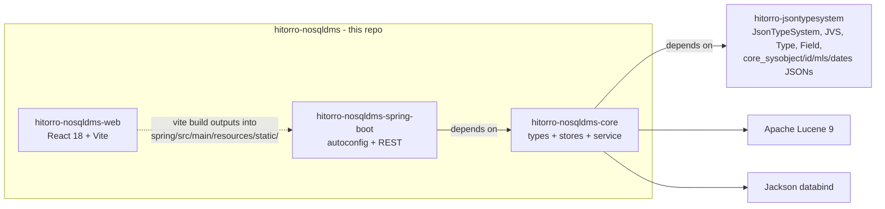

### What each module holds

**`hitorro-nosqldms-core`** — framework-neutral
- `com.hitorro.dms.model.*` — `Document`, `ContentRef`, `Reference`, `Grant`, `FolderMembership`, `Blob`, `VersionLabel`, `TypeDef` (UI projection)
- `com.hitorro.dms.store.*` — six store interfaces + `store.mem.*` in-memory impls
- `com.hitorro.dms.blob.*` — `BlobStore` + `InMemoryBlobStore`
- `com.hitorro.dms.index.*` — `IndexWriter` / `IndexSearcher` abstractions + `index.lucene.LuceneIndex`
- `com.hitorro.dms.service.*` — `DocumentService`, `TypeRegistry`, `TypeBootstrap`
- `com.hitorro.dms.context.*` — `DmsContext` (framework-neutral service registry)
- `src/main/resources/config/types/*.json` — 6 DMS-owned JVS type JSONs

**`hitorro-nosqldms-spring-boot`** — Spring Boot 3 runtime
- `DmsApplication` (`@SpringBootApplication` entry point)
- `config/DmsAutoConfiguration` + `DmsProperties`
- `web/*Controller` — 8 REST controllers (documents, versions, renditions, folders, references, ACLs, tags, types, search)
- `src/main/resources/static/` — built React UI

**`hitorro-nosqldms-web`** — React 18 + Vite + TypeScript
- `App.tsx` + `api/dms.ts` (typed fetch wrapper)
- `components/TypedFieldsForm.tsx` (renders a JVS type as a dynamic form)
- `pages/*` — Documents, DocumentDetail, Folder, Search

### Core-types come from the JVS dependency, not vendored

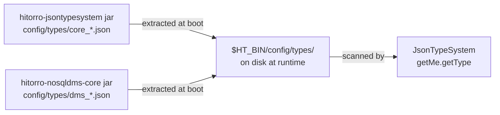

At startup `TypeBootstrap.bootstrap(home)` extracts every bundled
`config/types/*.json` from the classpath (whichever jar ships it) to
`$home/config/types/` and sets the `HT_BIN` system property. The JVS
`JsonTypeSystem.getMe()` singleton then discovers types via its
filesystem convention. Operators can drop their own `dms_*.json`
into that same dir and they're picked up on next boot.

## 3. Runtime architecture

### Three-tier structure

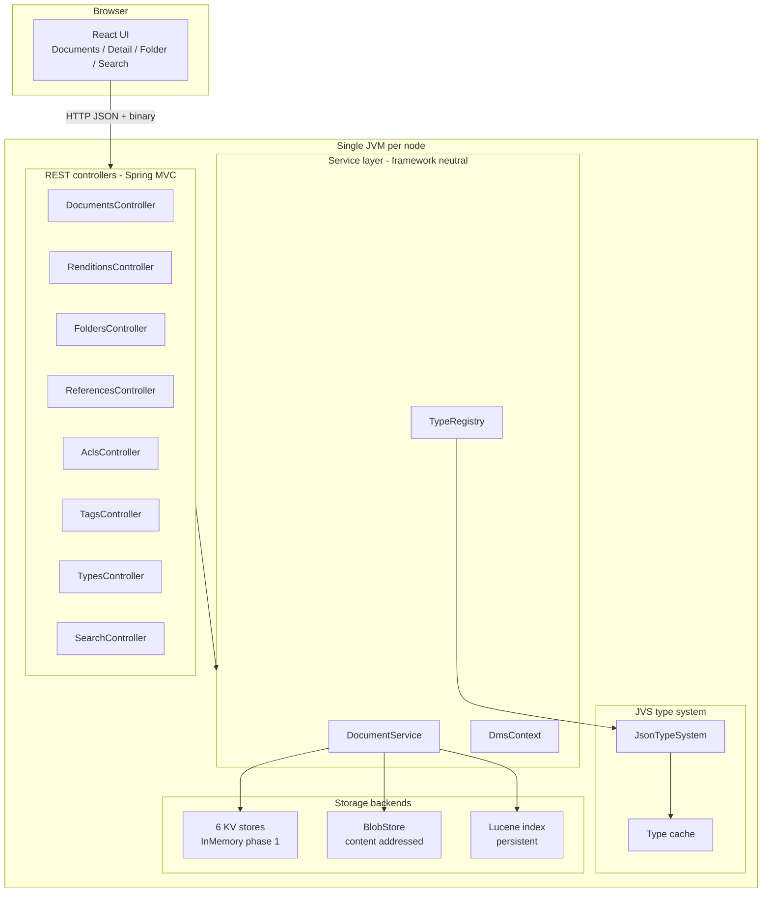

### Request lifecycle — create a doc

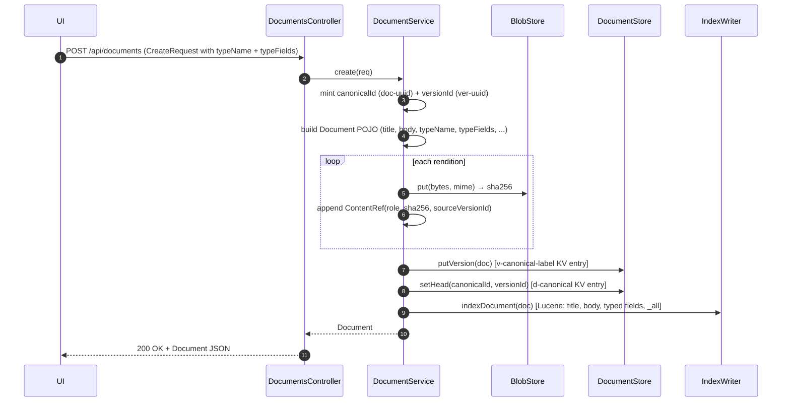

### Request lifecycle — check-in a new version (copy-on-write)

```mermaid
sequenceDiagram
  autonumber
  participant U as UI
  participant C as DocumentsController
  participant S as DocumentService
  participant B as BlobStore
  participant D as DocumentStore
  participant I as IndexWriter
  U->>C: POST /documents/{id}/versions (CheckInRequest)
  C->>S: checkIn(req)
  S->>D: getHead(canonicalId)
  D-->>S: prev head doc
  S->>S: bump VersionLabel per Kind
  S->>S: shallowCopyManifest(prev.content_refs)
  Note over S: Every entry keeps its sha256 → shared blob<br/>Zero bytes copied for metadata-only bumps
  loop each replacement rendition in req
    S->>B: put(bytes) → sha256 (dedups if identical)
    S->>S: replaceOrAppendRendition(manifest, fresh)
  end
  S->>S: merge typeFields (prev ∪ req; req wins per key)
  S->>D: putVersion(new) + putVersion(prev with is_head=false)
  S->>D: setHead(canonicalId, new.versionId)
  S->>I: indexDocument(new) + indexDocument(prev)
  S-->>C: Document
  C-->>U: 200 OK
```

### Request lifecycle — search

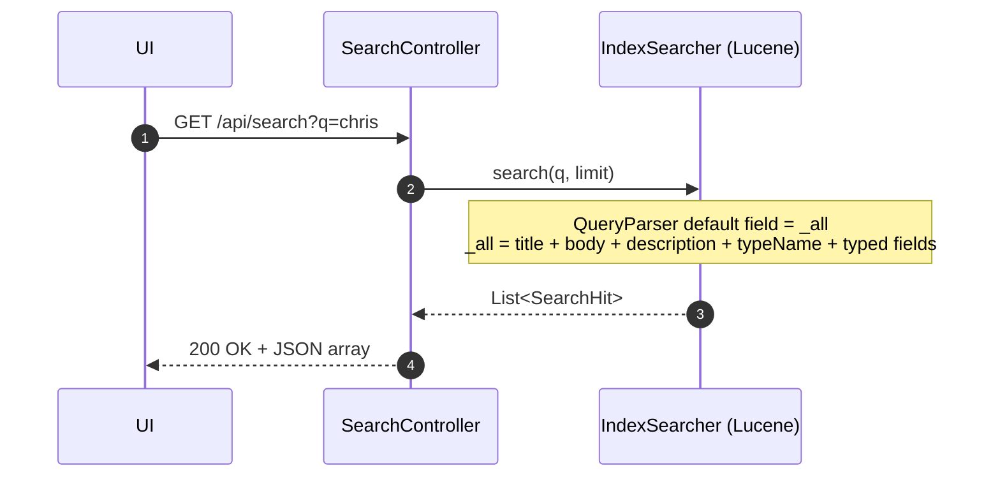

## 4. Data model

### Document (POJO wire format)

The primary POJO — see
[`Document.java`](../hitorro-nosqldms-core/src/main/java/com/hitorro/dms/model/Document.java).

| Field | Type | Purpose |
|---|---|---|
| `versionId` | String | Unique per version (`ver-<uuid>`). |
| `canonicalId` | String | Stable across every version (`doc-<uuid>`). |
| `versionLabel` | String | Assembled `MAJOR.MINOR.PATCH[-QUAL[N]][+BUILD]`. |
| `versionMajor` / `versionMinor` / `versionPatch` | long | Numeric parts, individually queryable. |
| `versionQualifier` | String | Pre-release tag; null = stable. |
| `versionQualNumber` | Long | Numeric suffix on the qualifier (`alpha3` → 3). |
| `versionBuild` | long | Monotonic build number across the whole `canonicalId` lineage. `MAX(build)` always identifies newest. |
| `versionKind` | String | `release` / `draft` / `branch` / `hotfix`. |
| `parentVersion` | String | Direct predecessor `versionId`. |
| `isHead` | boolean | Denormalised: true iff current head. |
| `isStable` | boolean | Denormalised: `versionQualifier == null`. |
| `title`, `body`, `description` | String | Content-defining metadata. |
| `contentType` | String | Registered JVS type name (`dms_wiki_page` / `dms_task` / …). |
| `typeName` | String | Registered JVS type name (same as `contentType` unless overridden). |
| `typeFields` | `Map<String,Object>` | Type-specific field values (matches the field defs on the JVS Type). |
| `contentRefs` | `List<ContentRef>` | Rendition manifest (copy-on-write). |
| `tombstoned` | boolean | Soft-delete marker. |
| `createdBy`, `modifiedBy`, `createdAt`, `modifiedAt` | | Audit. |

**Phase-1 note:** the `Document` POJO's `canonicalId` is a flat string.
The JVS `sysobject` type declares a composite `id` with `.did` +
`.domain`. Phase 2 will make the wire format the JsonNode form emitted
by `JVS.getJsonNode()` — the current POJO getters map (`canonicalId` →
`id.did`) but the on-the-wire shape is still flat for now.

### ContentRef (a rendition entry)

| Field | Type | Purpose |
|---|---|---|
| `role` | String | Rendition name (`primary`, `thumbnail`, `text-extract`, …). |
| `mime` | String | MIME type. |
| `sizeBytes` | long | |
| `sha256` | String | Content address. Same bytes ⇒ same hash ⇒ shared. |
| `url` | String | `blob://{sha256}` / `minio://…` / `s3://…` / `file://…`. |
| `inline` | String | Base64 body for very small blobs (≤ ~4 KB). |
| `generatedBy` | String | `user` (source of truth) or `pipeline:<name>` (derived). |
| `derivedFromRole` | String | For derived: which role it was computed from. |
| `sourceVersionId` | String | Version that first attached this specific entry. Unchanged across shared-content versions; updated only on replace. |
| `attachedAt` | Instant | |

### Reference, Grant, FolderMembership, Blob

Each has its own POJO — see the [model package](../hitorro-nosqldms-core/src/main/java/com/hitorro/dms/model/).
Not stored on the `Document`; each lives in its own store.

## 5. Storage layer

### The six storage interfaces

| Interface | Purpose | Impl provided |
|---|---|---|
| `DocumentStore` | Version + head persistence | `InMemoryDocumentStore` |
| `ReferenceStore` | Inter-doc references (outbound + inbound) | `InMemoryReferenceStore` |
| `FolderStore` | Many-to-many folder ↔ doc links | `InMemoryFolderStore` |
| `AclStore` | Per-(doc × principal) grants | `InMemoryAclStore` |
| `TagStore` | Free-form user tags | `InMemoryTagStore` |
| `BlobStore` | Content-addressed bytes | `InMemoryBlobStore` |

The in-memory impls default in phase 1. Every interface is designed
so a RocksDB-backed impl is a drop-in replacement — see
[Extending](#13-extending).

### KV keyspaces (design target for the persistent impl)

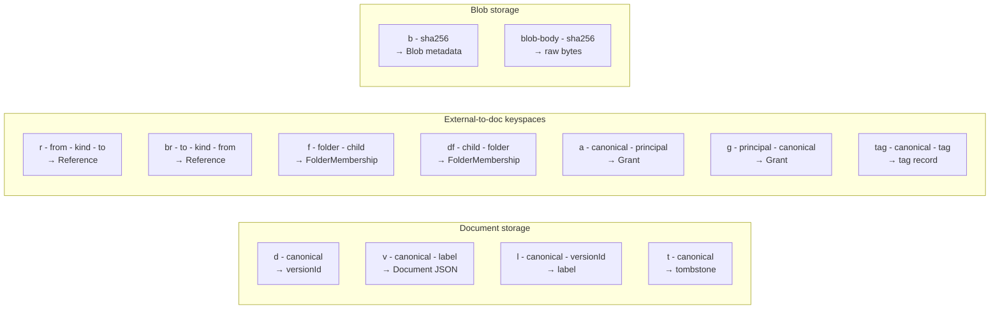

The core insight: **each concern gets its own keyspace, addressed by
prefix**. Adding a reference is 2 KV writes (`r|` + `br|`), doc body
untouched. Adding an ACL is 2 writes (`a|` + `g|`), doc untouched.
Linking to a folder is 2 writes (`f|` + `df|`), doc untouched.

### Lucene fields

`LuceneIndex` implements both `IndexWriter` and `IndexSearcher`.
Fields written per version:

- **Identity**: `version_id`, `canonical_id`
- **Version**: `version_label` (StringField), `version_major`/`minor`/`patch`/`build` (LongPoint), `version_qualifier`, `version_kind`, `is_head`, `is_stable`
- **Metadata**: `title` (TextField), `body`, `description`, `content_type`, `type_name`, `created_by`, `modified_by`
- **Renditions** (multi-valued facets): `content_refs.role`, `content_refs.mime`
- **Typed fields**: `tf.<fieldName>` per entry in `typeFields`
- **Catchall**: `_all` (title + description + body + typeName + all typed values concatenated)
- **Source**: `_source` StoredField with the full JSON — reconstruct without a KV round-trip

Query parser defaults to `_all`, so bare queries hit anywhere in the
document. Explicit field queries (`title:chris`, `tf.status:open`,
`version_major:2`) still work.

Idempotent updates via `updateDocument(new Term("version_id", …))`.

## 6. JVS type system integration

Every document in this DMS **is** a JVS-typed record. The type system
is the shared `com.hitorro.jsontypesystem` module — this DMS consumes
it as a compile dep, doesn't fork or shadow it.

### Type inheritance

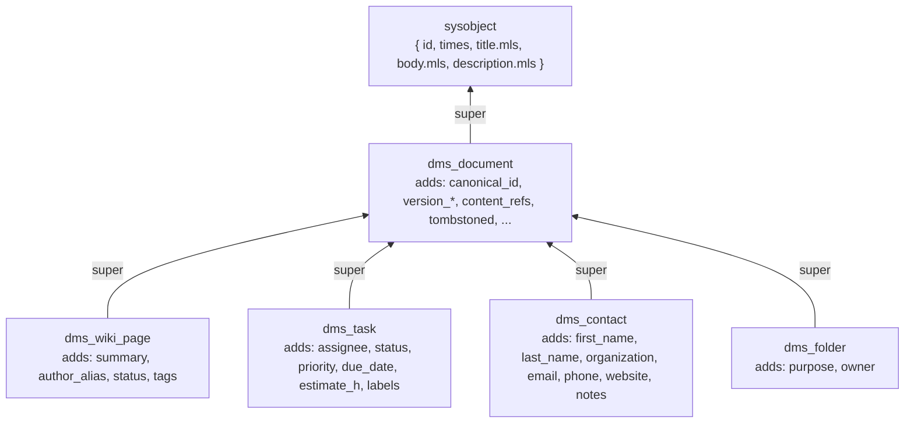

Every leaf DMS type transitively inherits sysobject's composite `id`
(`.did` / `.domain`), `times` (`.created` / `.modified`), and MLS
(`title` / `body` / `description`) fields for free. `JsonTypeSystem`
resolves inherited fields on lookup via `Type.getSuper()` recursion.

### Types provided by each jar

The core JVS types belong to the `hitorro-jsontypesystem` jar
(upstream fix). The DMS types belong to this project. Neither is
vendored into the other.

| Type | Jar | Purpose |
|---|---|---|
| `sysobject`, `id`, `mls`, `mlselem`, `dates`, `date`, `string`, `long`, `boolean`, `url` | `hitorro-jsontypesystem-3.0.1.jar` | Core JVS types — every JVS user needs these |
| `dms_content_ref`, `dms_document`, `dms_wiki_page`, `dms_task`, `dms_contact`, `dms_folder` | `hitorro-nosqldms-core-0.1.0.jar` | DMS-specific types |

### Bootstrap sequence

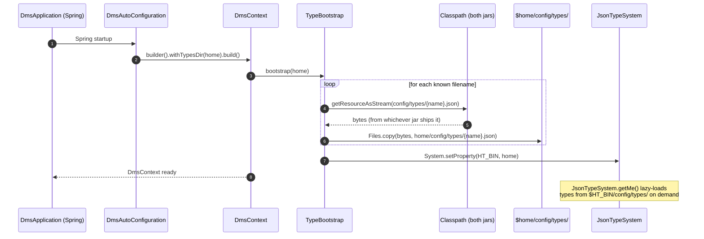

### `TypeRegistry` — the facade

`TypeRegistry` is a thin projection over `JsonTypeSystem` that gives
the UI a stable shape:

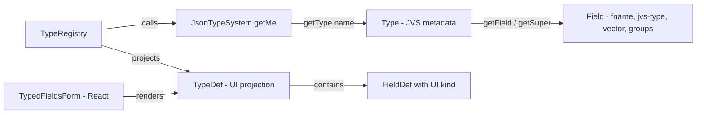

**Projection rules:**
- The DMS lists 4 types in the UI (`dms_wiki_page`, `dms_task`, `dms_contact`, `dms_folder`) — the rest are structural.
- Structural fields inherited from `sysobject` (`id`, `title`, `body`, …) and `dms_document` (versioning + content_refs) are **excluded** from the type form — the DMS manages those, not the user.
- Field kind is derived from the JVS primitive: `core_string` → `string`, `core_mls` → `text`, `core_url` → `url`, `core_long` → `long`, `core_double` → `double`, `core_date` → `date`, `core_boolean` → `boolean`, plus `array<…>` prefix when `vector: true`.
- Enum kinds are inferred from a field's `description` prefix (`"Enum-like: a / b / c"`) — a cheap convention that keeps the JSON simple.

### Example — the `dms_task` type

```json
{
  "name": "dms_task",
  "description": "A single unit of work — extends dms_document.",
  "super": "dms_document",
  "fields": [
    { "name": "assignee", "type": "core_string",
      "groups": [{"name":"index","method":"identifier"}] },
    { "name": "status",   "type": "core_string",
      "description": "Enum-like: todo / in-progress / blocked / done.",
      "groups": [{"name":"index","method":"identifier"}] },
    { "name": "priority", "type": "core_string",
      "description": "Enum-like: low / medium / high / urgent.",
      "groups": [{"name":"index","method":"identifier"}] },
    { "name": "due_date",   "type": "core_date" },
    { "name": "estimate_h", "type": "core_double" },
    { "name": "labels",     "type": "core_string", "vector": true,
      "groups": [{"name":"index","method":"identifier"}] }
  ]
}
```

At runtime `TypeRegistry.get("dms_task")` projects this into a
`TypeDef` — 6 UI-friendly `FieldDef`s (structural fields inherited
from super chain are filtered out) — which the React
`TypedFieldsForm` renders as a form (text input for assignee, enum
dropdown for status/priority from the parsed choices, date input,
number input, comma-separated multi-string input).

## 7. Copy-on-write rendition model

The rule: **check-in copies the manifest, not the bytes.**

```
v1.content_refs = [
    {role: primary,   sha256: A, sourceVersionId: v1},
    {role: thumbnail, sha256: T, sourceVersionId: v1, generatedBy: 'pipeline:thumbnailer'},
    {role: extract,   sha256: X, sourceVersionId: v1, generatedBy: 'pipeline:tika'}
]

# Check-in of a metadata-only change (title fix):
v2.content_refs = [
    {role: primary,   sha256: A, sourceVersionId: v1},   ← unchanged
    {role: thumbnail, sha256: T, sourceVersionId: v1},   ← unchanged
    {role: extract,   sha256: X, sourceVersionId: v1}    ← unchanged
]
# Zero bytes copied. Both versions share all renditions.

# Now PUT a new primary rendition on v2:
v2.content_refs = [
    {role: primary,   sha256: B, sourceVersionId: v2},   ← SPLIT
    {role: thumbnail, sha256: T, sourceVersionId: v1},   ← still shared
    {role: extract,   sha256: X, sourceVersionId: v1}    ← still shared
]
```

**Invariant:** two versions share a rendition iff they have the same
`sha256` for that role. No separate sharing bookkeeping needed —
content-address IS the sharing token.

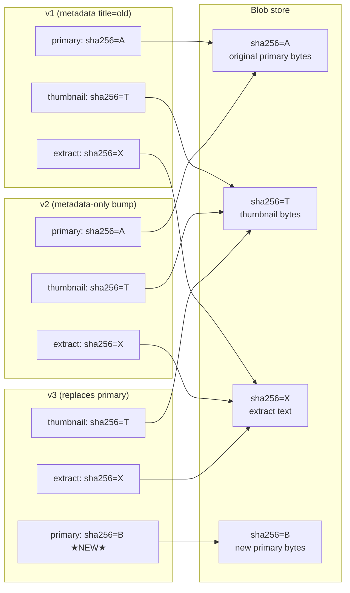

`DocumentService.attachRendition(...)` mutates a specific version's
manifest without bumping the version — used by pipelines (e.g. a
thumbnail worker) to attach derived renditions after the fact.

## 8. Folders — many-to-many, nested

Folders are documents. Membership is a separate KV keyspace so it
never rewrites either the folder or the child. A doc can be in any
number of folders; folders can nest arbitrarily.

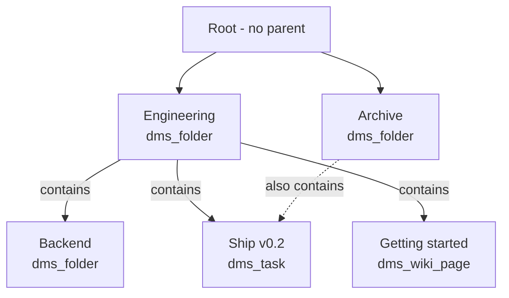

- **`Ship v0.2`** is linked into **both** Engineering and Archive
  simultaneously — that's the many-to-many property.
- **`Backend`** is a `dms_folder` inside another `dms_folder` — nesting.
- Membership is stored twice for cheap prefix scans in both
  directions: `f|folder|child` (list contents) + `df|child|folder`
  (list containing folders). Add is 2 writes; remove is 2 deletes;
  neither touches the folder body or the child body.

## 9. Build & run

### Prerequisites

- **Java 21+** on `$PATH`
- **Maven 3.9+**
- **pnpm** (or npm) for the React UI
- **`hitorro-jsontypesystem` 3.0.1** installed in `~/.m2` (build it once from
  its own repo if you don't have it)

### Full build

```bash
git clone https://github.com/geekychris/hitorro-nosqldms.git
cd hitorro-nosqldms

# 1. Build the UI (writes into hitorro-nosqldms-spring-boot/…/static/)
(cd hitorro-nosqldms-web && pnpm install && pnpm build)

# 2. Build + test the Java modules
mvn install
```

**Test summary:** 67 core tests + 5 Spring integration tests = 72 total.

### Run standalone (single-node)

```bash
java -jar hitorro-nosqldms-spring-boot/target/hitorro-nosqldms-spring-boot-0.1.0-app.jar

# then open http://localhost:8090
```

On first boot, the bundled JVS type JSONs (both core and DMS) are
extracted to `${dms.home}/config/types/` — you'll see files like
`core_sysobject.json`, `dms_document.json`, `dms_wiki_page.json` land
on disk. That's the JVS convention: `HT_BIN/config/types/*.json` is
where `JsonTypeSystem` looks for types.

Storage is in-memory by default — data doesn't survive restart
(phase-1 limitation). Lucene index alone is persistent under
`${dms.home}/lucene/`.

### Standalone (framework-neutral, no HTTP)

Embed the core inside another Java app:

```java
try (DmsContext ctx = DmsContext.builder()
        .withLucene(Path.of("/tmp/idx"))
        .withTypesDir(Path.of("/var/mydms"))   // JVS HT_BIN root
        .build()) {

    // TypeBootstrap already ran inside build() —
    // JsonTypeSystem is loaded and has all types visible.

    DocumentService svc = ctx.documentService();

    CreateRequest req = new CreateRequest();
    req.title = "Ship v0.2";
    req.contentType = "dms_task";
    req.typeName = "dms_task";
    req.typeFields = Map.of("assignee", "alice", "status", "todo");
    req.createdBy = "cli";
    Document v1 = svc.create(req);

    // Direct JVS access — the type is real, inheritance is honoured
    Type taskType = ctx.typeRegistry().jvsType("dms_task").orElseThrow();
    assert taskType.getSuper().getName().equals("dms_document");
    assert taskType.getField("title") != null;   // inherited from sysobject
}
```

### Dev mode (hot-reload the UI)

```bash
# Terminal 1 — backend on :8090
java -jar hitorro-nosqldms-spring-boot/target/*app.jar

# Terminal 2 — UI dev server on :5174, proxies /api → :8090
cd hitorro-nosqldms-web && pnpm dev
```

## 10. Configuration

Standard Spring Boot properties.

| Key | Default | Purpose |
|---|---|---|
| `server.port` | `8090` | HTTP port |
| `dms.home` | `${user.home}/.hitorro/dms` | Persistent storage root — becomes HT_BIN for JVS |
| `dms.lucene-enabled` | `true` | Toggle Lucene index |
| `dms.lucene-dir` | `${dms.home}/lucene` | Override index location |
| `dms.types-dir` | `${dms.home}` | Override JVS HT_BIN root — `config/types/` lives underneath |

Drop your own type JSONs into `${dms.home}/config/types/dms_myNewType.json` and
they're picked up on next boot.

## 11. Java API

Everything in this section lives in `hitorro-nosqldms-core` and is
framework-independent.

### `DmsContext` — the entry point

Framework-neutral service registry. Mirrors hitorro's
`com.hitorro.util.startupframework.ServiceContext` pattern — one
object owns the wired-up services, hand out via typed accessors.

```java
// Zero-config: all in-memory, no Lucene index.
DmsContext ctx = DmsContext.inMemory();

// Fluent builder — swap any store, add Lucene, set types dir:
DmsContext ctx = DmsContext.builder()
        .documentStore(myCustomDocumentStore)
        .blobStore(myS3BlobStore)
        .withLucene(Path.of("/var/dms/lucene"))
        .withTypesDir(Path.of("/var/dms"))     // JVS HT_BIN root
        .with(MyExtra.class, myExtra)
        .build();

// Accessors:
DocumentService svc     = ctx.documentService();
TypeRegistry    types   = ctx.typeRegistry();
DocumentStore   docs    = ctx.documentStore();
ReferenceStore  refs    = ctx.referenceStore();
FolderStore     folders = ctx.folderStore();
AclStore        acls    = ctx.aclStore();
TagStore        tags    = ctx.tagStore();
BlobStore       blobs   = ctx.blobStore();
IndexWriter     writer  = ctx.indexWriter();
IndexSearcher   search  = ctx.indexSearcher();

ctx.close();     // closes Lucene if attached
```

### `TypeBootstrap` — how types get onto disk

Called automatically by `DmsContext.build()`. Extracts bundled
classpath types to `$home/config/types/` and sets `HT_BIN` so
`JsonTypeSystem` finds them.

```java
// Manual invocation (rare — DmsContext does this for you)
List<String> extracted = TypeBootstrap.bootstrap(Path.of("/var/mydms"));
// extracted → ["core_sysobject", "core_id", ..., "dms_wiki_page", ...]

Type wikiType = TypeBootstrap.type("dms_wiki_page");
// = JsonTypeSystem.getMe().getType("dms_wiki_page")
```

### `TypeRegistry` — projection facade

```java
TypeRegistry r = ctx.typeRegistry();

// UI-friendly projection
List<TypeDef>     types = r.all();          // 4 DMS types
Optional<TypeDef> task  = r.get("dms_task");

// Escape hatch — raw JVS Type
Optional<Type> jvs = r.jvsType("dms_task");
Type t = jvs.orElseThrow();
Type superT = t.getSuper();                 // dms_document
Type grandT = superT.getSuper();            // sysobject
Field assignee = t.getField("assignee");
Field title    = t.getField("title");       // resolves through super to sysobject
boolean isVec  = t.getField("labels").isVector();

// Light validation — required-field check
List<String> errs = r.validate("dms_task", Map.of("priority", "high"));
// errs includes "required field missing: assignee" (if that field was marked required)
```

### `DocumentService`

```java
// Create — mints doc-<uuid> canonical + ver-<uuid> version at 1.0.0
Document create(CreateRequest req) throws IOException;

// Check in a new version. Copy-on-write per rendition.
Document checkIn(CheckInRequest req) throws IOException;

// Attach a rendition to a specific EXISTING version — no version bump.
Document attachRendition(String canonicalId, String versionId,
                         String role, String mime, byte[] bytes,
                         String generatedBy, String derivedFromRole) throws IOException;

// Remove one rendition from one version.
void deleteRendition(String canonicalId, String versionId, String role) throws IOException;

// Fetch bytes of one rendition on one version.
Optional<byte[]> readRendition(String canonicalId, String versionId, String role) throws IOException;

// Soft-delete.
void tombstone(String canonicalId);

// Reads
Optional<Document> getHead(String canonicalId);
Optional<Document> getVersion(String canonicalId, String versionLabel);
Optional<Document> getVersionById(String versionId);
List<Document>    listVersions(String canonicalId);
List<String>      listCanonicals();
```

### `CreateRequest` / `CheckInRequest`

```java
CreateRequest c = new CreateRequest();
c.title       = "Spec";
c.body        = "Long body text.";
c.contentType = "dms_task";       // registered JVS type name
c.typeName    = "dms_task";
c.typeFields  = Map.of("assignee", "alice", "status", "todo");
c.createdBy   = "user:alice";
c.withRendition("primary", "text/plain", "hello".getBytes());
Document v1 = svc.create(c);

CheckInRequest ci = new CheckInRequest();
ci.canonicalId = v1.canonicalId;
ci.title       = "Spec v2";
ci.bumpKind    = VersionLabel.Kind.MINOR;   // default
ci.qualifier   = "beta";                    // optional — enters pre-release cycle
ci.typeFields  = Map.of("status", "in-progress");   // merged with prev head
ci.withRendition("primary", "image/jpeg", newBytes);   // replaces primary; other renditions still shared
Document v2 = svc.checkIn(ci);
```

**Merge semantics for `typeFields`:** the new version's fields are
`prev.typeFields ∪ req.typeFields` with request keys taking precedence.
Omitted keys inherit from the previous head.

### `VersionLabel`

Immutable, comparable, parseable.

```java
VersionLabel l = VersionLabel.parse("2.1.3-alpha3+45");
l.isStable();               // false
l.label();                  // "2.1.3-alpha3+45"

// Bump — new label for the next check-in
l.bump(Kind.MAJOR);         // → 3.0.0            (drops qualifier by default)
l.bump(Kind.MINOR);         // → 2.2.0
l.bump(Kind.PATCH);         // → 2.1.4
l.bump(Kind.QUALIFIER);     // → 2.1.3-alpha4
l.bump(Kind.MINOR, "beta"); // → 2.2.0-beta1     (enter pre-release cycle)

// Ordering
VersionLabel.parse("1.0.0").compareTo(VersionLabel.parse("1.0.0-alpha"));   // > 0
```

### Storage interfaces

`DocumentStore` is the biggest:

```java
public interface DocumentStore {
    void putVersion(Document doc);
    void setHead(String canonicalId, String versionId);
    Optional<Document> getHead(String canonicalId);
    Optional<Document> getVersion(String canonicalId, String label);
    Optional<Document> getVersionById(String versionId);
    List<Document>    listVersions(String canonicalId);
    List<String>      listCanonicals();
    void tombstone(String canonicalId);
    boolean isTombstoned(String canonicalId);
    void purge(String canonicalId);
}
```

The other stores are similarly narrow — see the interface files
under [`store/`](../hitorro-nosqldms-core/src/main/java/com/hitorro/dms/store/).

### `BlobStore`

```java
Blob        b = blobStore.put(bytes, "image/jpeg");
String      h = b.sha256;
Optional<byte[]> read = blobStore.get(h);
Optional<Blob>   meta = blobStore.stat(h);
boolean          has  = blobStore.exists(h);
blobStore.delete(h);
```

### `IndexWriter` / `IndexSearcher`

```java
indexWriter.indexDocument(doc);      // idempotent
indexWriter.deleteDocument(versionId);
indexWriter.commit();

List<SearchHit> hits = indexSearcher.search("chris AND tf.status:open", 20);
Map<String,Object> stored = indexSearcher.fetch(versionId);
```

## 12. REST API

Base URL: `http://<host>:<port>/`  (default `http://localhost:8090`).
All request/response bodies are JSON unless noted.

### Documents

| Method | Path | Purpose | Request body | Response |
|---|---|---|---|---|
| `POST` | `/api/documents` | Create new doc at v1.0.0 | `CreateRequest` | `Document` |
| `GET` | `/api/documents` | List every canonical id | — | `String[]` |
| `GET` | `/api/documents/{id}` | Current head | — | `Document` |
| `DELETE` | `/api/documents/{id}` | Soft-delete (tombstone) | — | `204` |
| `GET` | `/api/documents/{id}/versions` | Version history | — | `Document[]` |
| `GET` | `/api/documents/{id}/versions/{label}` | One specific version | — | `Document` |
| `POST` | `/api/documents/{id}/versions` | Check in a new version | `CheckInRequest` | `Document` |

**`CreateRequest` body:**

```json
{
  "title":       "Ship v0.2",
  "body":        "The 0.2 release notes.",
  "description": "One-line summary.",
  "contentType": "dms_task",
  "typeName":    "dms_task",
  "typeFields":  { "assignee":"alice", "status":"todo", "priority":"high" },
  "createdBy":   "user:alice"
}
```

**`CheckInRequest` body** (canonicalId comes from URL):

```json
{
  "title":       "Ship v0.2 (fixed)",
  "bumpKind":    "MINOR",
  "typeFields":  { "status": "in-progress" },
  "modifiedBy":  "user:bob"
}
```

`bumpKind` ∈ `MAJOR`, `MINOR`, `PATCH`, `QUALIFIER`. Fields absent
from the body inherit from the previous head; `typeFields` merges
per-key.

### Renditions

Copy-on-write per rendition. Same role ⇒ replaces; new role ⇒ appends.

| Method | Path | Purpose | Body |
|---|---|---|---|
| `GET` | `/api/documents/{id}/renditions` | List renditions on head | — |
| `GET` | `/api/documents/{id}/versions/{versionId}/renditions` | List on a specific version | — |
| `GET` | `/api/documents/{id}/renditions/{role}` | Read bytes on head | — (returns raw bytes) |
| `GET` | `/api/documents/{id}/versions/{versionId}/renditions/{role}` | Read bytes on a specific version | — |
| `PUT` | `/api/documents/{id}/versions/{versionId}/renditions/{role}` | Attach or replace a rendition | raw bytes (`Content-Type` header sets the MIME) |
| `DELETE` | `/api/documents/{id}/versions/{versionId}/renditions/{role}` | Remove rendition entry | — |

**PUT headers:**
- `Content-Type: image/jpeg` — becomes the stored MIME
- `X-Generated-By: user` (default) or `X-Generated-By: pipeline:<name>` — provenance tag
- `X-Derived-From: primary` — for derived renditions, which role was the source

### References

| Method | Path | Purpose | Body |
|---|---|---|---|
| `GET` | `/api/documents/{id}/references` | Outbound refs | — |
| `GET` | `/api/documents/{id}/references/inbound` | Inbound refs | — |
| `POST` | `/api/documents/{id}/references` | Add ref (from `id`) | `Reference` |
| `DELETE` | `/api/documents/{id}/references/{to}/{kind}` | Remove one ref | — |

### ACLs

| Method | Path | Purpose | Body |
|---|---|---|---|
| `GET` | `/api/documents/{id}/acls` | List grants on doc | — |
| `POST` | `/api/documents/{id}/acls` | Grant permission | `Grant` |
| `DELETE` | `/api/documents/{id}/acls/{principal}/{permission}` | Revoke grant | — |

### Folders

Folders are documents (type `dms_folder`) plus many-to-many
membership entries.

| Method | Path | Purpose | Body |
|---|---|---|---|
| `GET` | `/api/folders/{folder}/contents` | List folder contents | — |
| `POST` | `/api/folders/{folder}/contents` | Link doc into folder | `{"child":"doc-…","addedBy":"user:alice"}` |
| `DELETE` | `/api/folders/{folder}/contents/{child}` | Unlink | — |
| `GET` | `/api/folders/for-doc/{child}` | List every folder containing `child` | — |

A doc can be in any number of folders. Folders themselves are docs,
so nesting = link folder-B into folder-A. Link/unlink is a 2-KV
write; neither the folder body nor the child body is touched.

### Tags

| Method | Path | Purpose |
|---|---|---|
| `GET` | `/api/documents/{id}/tags` | List tags |
| `POST` | `/api/documents/{id}/tags/{tag}` | Add tag |
| `DELETE` | `/api/documents/{id}/tags/{tag}` | Remove tag |
| `GET` | `/api/tags/{tag}/documents` | List docs with tag |

### Types

Read-only projection over the JVS type system.

| Method | Path | Purpose |
|---|---|---|
| `GET` | `/api/types` | List DMS type projections (4 today) |
| `GET` | `/api/types/{name}` | Fetch one projected TypeDef |

### Search

Lucene classic query grammar over the primary index. Default field
is `_all` (catchall).

| Method | Path | Purpose |
|---|---|---|
| `GET` | `/api/search?q=<query>&limit=<n>` | Full-text search |

**Query examples:**

- `chris` — bare query. Matches title/body/description/typed fields via `_all`.
- `title:chris` — exact-field.
- `body:kubernetes AND tf.status:open` — typed-field filter.
- `type_name:dms_task AND tf.priority:high` — all high-priority tasks.
- `is_head:true` — only current head versions.

### Curl examples

```bash
# Create a typed task
curl -X POST http://localhost:8090/api/documents -H 'content-type: application/json' \
  -d '{"title":"Ship v0.2","contentType":"dms_task","typeName":"dms_task",
       "typeFields":{"assignee":"alice","status":"todo","priority":"high"},
       "createdBy":"cli"}'

# Attach a rendition (PUT raw bytes)
CID=doc-abc-…; VID=ver-xyz-…
echo "PRIMARY BYTES" | curl -X PUT --data-binary @- \
     -H 'content-type: text/plain' \
     "http://localhost:8090/api/documents/$CID/versions/$VID/renditions/primary"

# Read rendition
curl "http://localhost:8090/api/documents/$CID/renditions/primary"

# Create a folder + link the task into it
FOLDER=$(curl -sS -X POST http://localhost:8090/api/documents -H 'content-type: application/json' \
     -d '{"title":"Engineering","contentType":"dms_folder","typeName":"dms_folder",
          "typeFields":{"purpose":"Home for engineering docs","owner":"eng-lead"},
          "createdBy":"cli"}' | python3 -c "import json,sys; print(json.load(sys.stdin)['canonicalId'])")
curl -X POST "http://localhost:8090/api/folders/$FOLDER/contents" \
     -H 'content-type: application/json' \
     -d "{\"child\":\"$CID\",\"addedBy\":\"cli\"}"

# Check-in a new version (metadata-only — content stays shared)
curl -X POST "http://localhost:8090/api/documents/$CID/versions" \
     -H 'content-type: application/json' \
     -d '{"title":"Ship v0.2 (fixed)","bumpKind":"MINOR"}'

# List versions
curl "http://localhost:8090/api/documents/$CID/versions"

# List types (JVS projection)
curl "http://localhost:8090/api/types"

# Search
curl 'http://localhost:8090/api/search?q=chris'
```

## 13. Extending

### Add a new document type

1. Write a JVS type JSON — must extend `dms_document` (or `sysobject`
   directly if you don't need the DMS common fields).

    ```json
    {
      "name": "dms_meeting_note",
      "description": "Notes from a meeting with attendees and action items.",
      "super": "dms_document",
      "fields": [
        { "name": "attendees", "type": "core_string", "vector": true,
          "groups": [{"name":"index","method":"identifier"}] },
        { "name": "date",      "type": "core_date" },
        { "name": "outcome",   "type": "core_string",
          "description": "Enum-like: informational / decision / action-required.",
          "groups": [{"name":"index","method":"identifier"}] },
        { "name": "action_items", "type": "core_mls" }
      ]
    }
    ```

2. Drop it into `${dms.home}/config/types/dms_meeting_note.json`.

3. Add its name to `DMS_TYPE_NAMES` in `TypeRegistry` (if you want it
   in the UI picker) OR just extend the registry to enumerate every
   `dms_*` type on the filesystem (a small change).

4. Restart. The type appears in the create dialog, its fields render
   as a dynamic form, and `JsonTypeSystem.getType("dms_meeting_note")`
   works for Java callers.

### Swap in a persistent storage impl

Provide any of the six store interfaces as a Spring bean:

```java
@Configuration
public class MyStorageConfig {
    @Bean DocumentStore documentStore() { return new RocksDBDocumentStore(path); }
    @Bean BlobStore     blobStore()     { return new S3BlobStore(bucket); }
}
```

Standalone (no Spring):

```java
DmsContext ctx = DmsContext.builder()
    .documentStore(new RocksDBDocumentStore(path))
    .blobStore(new S3BlobStore(bucket))
    .withLucene(Path.of("/var/dms/lucene"))
    .build();
```

### Extend the UI type-widget mapping

Edit
[`TypedFieldsForm.tsx`](../hitorro-nosqldms-web/src/components/TypedFieldsForm.tsx)
— the `switch (field.kind)` block. Add a case for a new kind (e.g.
`richtext`) that renders your custom widget component. The value
returned by `onChange` gets stored on `typeFields` verbatim.

## 14. Design notes + tradeoffs

### What's deferred

- **Distribution.** Phase 1 is single-node. Partitioning by
  `canonical_id` and cross-partition back-refs is phase 3.
- **ACL inheritance walk.** Explicit grants work; folder-inherited
  grants are phase 4.
- **MinIO / S3 blob backends.** Interface + KV impl only in phase 5.
- **Blob GC pipeline.** Mark-and-sweep is designed but not implemented.
- **Check-out leases.** Fields on `Document` exist but no server-side
  enforcement.
- **JVS-native storage.** Documents are stored as flat POJOs — the
  wire form doesn't yet match the JVS-serialized JsonNode with
  `id.did` / `title.mls[en].text` composite paths. The type system
  foundation is in place for this phase-2 refactor.

### Explicit tradeoffs

- **No cross-document ACID.** Same-partition (same-doc) ops are atomic.
  Cross-doc ops (references, folder membership) are eventually
  consistent + idempotent in a distributed deploy. If you need
  transactional integrity across multiple docs, this is not the system.
- **Read-optimized rendition manifest.** Attaching a derived rendition
  requires rewriting the version's `v|` KV entry. Chose read-side
  simplicity over write efficiency because reads dominate for
  renditions (list them on every doc-detail view).
- **Lucene as sole search.** Range queries + full-text + faceting are
  great; joins across indexes are limited. If you need cross-document
  analytics, project into a warehouse.
- **In-memory phase-1 stores.** Data doesn't survive restart until a
  persistent impl is wired in. Lucene index alone is persistent.

## References

- Design proposal (jsontypesystem repo):
  [distributed-dms.md](https://github.com/geekychris/hitorro-jsontypesystem/blob/main/docs/distributed-dms.md)
- Framework-neutral core: [`hitorro-nosqldms-core/`](../hitorro-nosqldms-core/)
- Spring Boot runtime: [`hitorro-nosqldms-spring-boot/`](../hitorro-nosqldms-spring-boot/)
- React UI: [`hitorro-nosqldms-web/`](../hitorro-nosqldms-web/)
- JVS type system: [`hitorro-jsontypesystem/`](https://github.com/geekychris/hitorro-jsontypesystem/)
